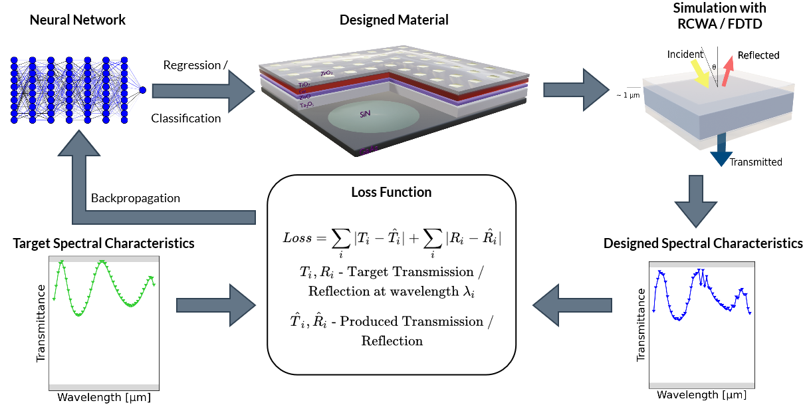

# Neural Inverse Design of Nanostructures (NIDN)

[](https://nidn.readthedocs.io/en/latest/?badge=latest)  
 

 

<!-- TABLE OF CONTENTS -->
<details open="open">
  <summary>Table of Contents</summary>
  <ol>
    <li>
      <a href="#about-the-project">About The Project</a>
      <ul>
        <li><a href="#built-with">Built With</a></li>
      </ul>
    </li>
    <li>
      <a href="#getting-started">Getting Started</a>
      <ul>
        <li><a href="#prerequisites">Prerequisites</a></li>
        <li><a href="#installation">Installation</a></li>
        <li><a href="#test">Test</a></li>
      </ul>
    </li>
    <li><a href="#usage">Usage</a></li>
    <li><a href="#contributing">Contributing</a></li>
    <li><a href="#license">License</a></li>
    <li><a href="#contact">Contact</a></li>
  </ol>
</details>

<!-- ABOUT THE PROJECT -->

## About The Project

Neural Inverse Design of Nanostructures (NIDN) is a Python project by the Advanced Concepts Team of ESA. The goal of the project is to enable inverse design of stacks of nanostructures, metamaterials, photonic crystals, etc., using neural networks in PyTorch. As forward models, it supports [rigorous coupled-wave analysis](https://en.wikipedia.org/wiki/Rigorous_coupled-wave_analysis) and a [finite-difference time-domain](https://eecs.wsu.edu/~schneidj/ufdtd/) solver. There is an accompanying paper about to be published.

<p align="center">
  <a href="https://github.com/esa/nidn">
    
  </a>
  <p align="center">
    Neural Inverse Design of Nanostructures with PyTorch
    <br />
    <a href="https://nidn.readthedocs.io"><strong>Explore the docs »</strong></a>
    <br />
    <br />
    <a href="https://github.com/esa/NIDN/blob/main/notebooks/Inverse_Material_Design_with_RCWA.ipynb">View Example notebook</a>
    ·
    <a href="https://github.com/esa/nidn/issues">Report Bug</a>
    ·
    <a href="https://github.com/esa/nidn/issues">Request Feature</a>
  </p>
</p>

### Built With

This project is based on:

- [grcwa](https://github.com/weiliangjinca/grcwa) which was modified to include [PyTorch](https://pytorch.org/) support to allow neural network training.
- [fdtd](https://github.com/flaport/fdtd) which was modified to allow training neural networks with it and match the setup of NIDN

For more details than provided with NIDN on the forward models please refer to their docs. The adaptations of there code are in the folders [nidn/trcwa/](https://github.com/esa/NIDN/tree/main/nidn/trcwa) and [nidn/fdtd/](https://github.com/esa/NIDN/tree/main/nidn/fdtd).

Below you can see results of an exemplary optimization of a three-uniform-layer material to design a 1150nm filter.


<!-- GETTING STARTED -->

## Getting Started

This is a brief guide how to set up NIDN.

### Installation

The easiest way is to pip install NIDN via

`pip install nidn`.

Alternatively, to use the latest code from this repo `git clone` the repository and make sure you have all the requirements installed.

To set up a conda environment for the project run `conda env create -f environment.yml`.

This will create a conda environment called `nidn` for it.

If you just want to install the module in your current environment you can run

`pip install .` in the root folder where the `setup.py` is located.

While NIDN does support GPU utilization there are only modest performance benefits to it at time of writing.

### Test

After cloning the repository, developers can check the functionality of NIDN by running the following command in the `nidn/tests` directory:

```sh
pytest
```

<!-- USAGE EXAMPLES -->

## Usage

### Config

NIDN uses a central config file which is passed through the entire program. The default config parameters can be seen [here](https://github.com/esa/NIDN/blob/main/nidn/utils/resources/default_config.toml). Practical usage of the config files is demonstrated in the [included Jupyter notebook](https://github.com/esa/NIDN/tree/main/notebooks).

### Use Case 1: Forward Model Simulation

This serves to compute the spectral characteristics of a material. The Jupyter notebooks [Forward_Model_Simulation_with_FDTD.ipynb](https://github.com/esa/NIDN/blob/main/notebooks/Forward_Model_Simulation_with_FDTD.ipynb) and [Forward_Model_Simulation_with_RCWA.ipynb](https://github.com/esa/NIDN/blob/main/notebooks/Forward_Model_Simulation_with_RCWA.ipynb) demonstrate this use case.

### Use Case 2: Inverse Design of Nanostructures

This is the case you aim to design a material matching some target spectral characteristics. A thorough explanation is given in the Jupyter notebooks [Inverse_Material_Design_with_FDTD.ipynb](https://github.com/esa/NIDN/blob/main/notebooks/Inverse_Material_Design_with_FDTD.ipynb) and [Inverse_Material_Design_with_RCWA.ipynb](https://github.com/esa/NIDN/blob/main/notebooks/Inverse_Material_Design_with_RCWA.ipynb).

### Logging & Docs

To change the logging verbosity call `nidn.setLogLevel(level)` where level is one of `TRACE`,`DEBUG`,`INFO`,`WARN` and `ERROR`.

Detailed docs of NIDN are [online](https://nidn.readthedocs.io/en/latest/) can be built with sphinx. To do so, make sure [sphinx](https://www.sphinx-doc.org/en/master/usage/installation.html) is installed and run `make html` in the docs folder to get a local html version of the docs. readthedocs support may follow.

### Supported Materials

If you try to design a material with the `classification` approach (see [mentioned notebooks](https://github.com/esa/NIDN/blob/main/notebooks/Inverse_Material_Design_with_RCWA.ipynb) for more details), all materials in the [materials folder](https://github.com/esa/NIDN/tree/main/nidn/materials/data) will be utilized. You can manually add other materials there using data from, e.g., [refractiveindex.info](https://refractiveindex.info/).

<!-- ROADMAP -->

## Roadmap

See the [open issues](https://github.com/esa/nidn/issues) for a list of proposed features (and known issues).

<!-- CONTRIBUTING -->

## Contributing

The project is open to community contributions. Feel free to open an [issue](https://github.com/esa/nidn/issues) or write us an email if you would like to discuss a problem or idea first.

If you want to contribute, please

1. Fork the project on [GitHub](https://github.com/esa/nidn).
2. Get the most up-to-date code by following this quick guide for installing nidn from source:
   1. Get [miniconda](https://docs.conda.io/en/latest/miniconda.html) or similar
   2. Clone the repo
   ```sh
   git clone https://github.com/esa/nidn.git
   ```
   3. With the default configuration PyTorch with CUDA
      support is installed.
      If this should not happen, comment out `cudatoolkit` in the `environment.yml`.
   4. Set up the environment. This creates a conda environment called
      `nidn` and installs the required dependencies.
   ```sh
   conda env create -f environment.yml
   conda activate nidn
   ```

Once the installation is done, you are ready to contribute.
Please note that PRs should be created from and into the `main` branch.

3. Create your Feature Branch (`git checkout -b feature/AmazingFeature`)
4. Commit your Changes (`git commit -m 'Add some AmazingFeature'`)
5. Push to the Branch (`git push origin feature/AmazingFeature`)
6. Open a Pull Request on the `main` branch.

and we will have a look at your contribution as soon as we can.

Furthermore, please make sure that your PR passes all automated tests. Review will only happen after that.
Only PRs created on the `main` branch with all tests passing will be considered.

<!-- LICENSE -->

## License

Distributed under the GPL-3.0 License. See [LICENSE](https://github.com/esa/nidn/blob/main/LICENSE) for more information.

<!-- CONTACT -->

## Contact

Created by ESA's [Advanced Concepts Team](https://www.esa.int/gsp/ACT/index.html)

- Pablo Gómez - `pablo.gomez at esa.int`

Project Link: [https://github.com/esa/nidn](https://github.com/esa/nidn)

<!-- ACKNOWLEDGEMENTS
This README was based on https://github.com/othneildrew/Best-README-Template
-->
