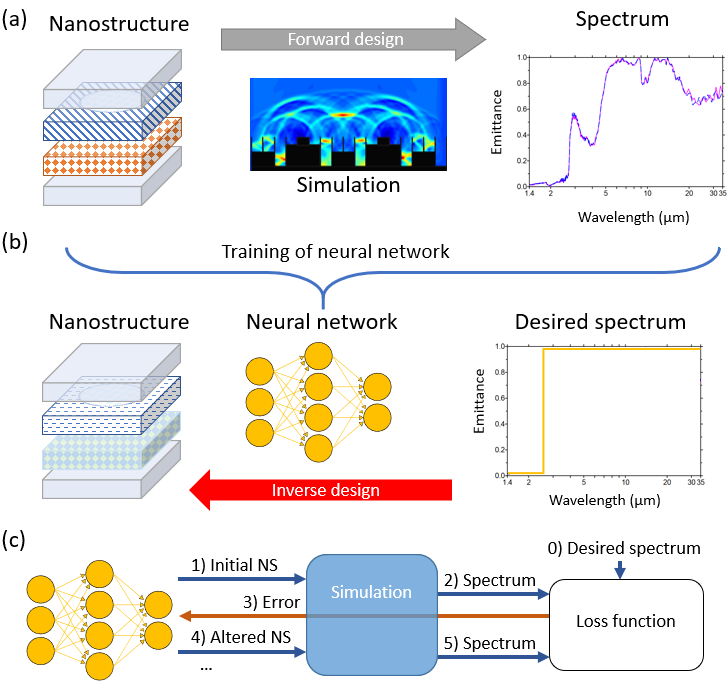
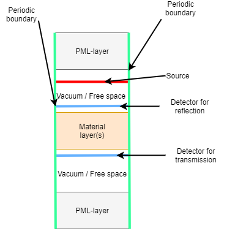

Introduction to Neural Inverse Design of Nanostructures (NIDN)
================================================================

Welcome to the notebook describing Neural Inverse Design of
Nanostructures (NIDN).

NIDN is a Python package for inverse design of nanostructures using
neural networks, powered by `PyTorch <https://pytorch.org/>`__. With
NIDN, the user can find configurations of three-dimensional
(nano-)structures and metamaterials that match certain desirable
properties, for instance the reflection and absorption of light at
certain wavelengths.

For this notebook, we will showcase one example of how NIDN can be used.
Together with our Torch-based Rigorous Coupled-Wave Analysis (TRCWA)
simulation tool, which is based on the `GRCWA
package <https://github.com/weiliangjinca/grcwa>`__ made by Weiliang
Jin, we can find a structure that meets our requirements for reflection,
transmission, and absorption, e.g., as for the example shown below.

.. code:: ipython3

    # Picture of an example plot here
    ### NB: The legend should not say *Produced* Reflectance!
    # 

Important information and core settings in NIDN
-----------------------------------------------

You might notice the word ``cfg`` a lot in the TRCWA code. The config
class ``cfg`` contains all of the parameters the user would need while
using TRCWA and makes setting up the inverse design process much more
convinient. Feel free to check it out in our
`documentation <https://nidn.readthedocs.io/en/latest/>`__. TODO: Link
to doc page where all config parameters are explained.

Below are some core details and settings needed for understanding how
NIDN works.

TRCWA and its layers
~~~~~~~~~~~~~~~~~~~~

TRCWA uses two different kinds of layers; uniform and heterogeneous
(patterned). What they have in common is that they are periodic in the
two lateral directions and invariant along the vertical direction.

Uniform Layers
^^^^^^^^^^^^^^

A uniform layer has the same dielectric constant across the entire
layer.

Heterogeneous Layers
^^^^^^^^^^^^^^^^^^^^

Heterogeneous (patterned) layers are divided into a grid, where each
grid point can have individual dielectric constants.

Neural Inverse Design
~~~~~~~~~~~~~~~~~~~~~

NIDN is based on a machine learning (ML) approach by `Mildenhall et
al. <https://link.springer.com/chapter/10.1007/978-3-030-58452-8_24>`__
called NeRF. Both the NeRF network and similar ones, like `sinusoidal
representation networks
(SIRENs) <https://arxiv.org/pdf/2006.09661.pdf>`__, are available in
NIDN.

Our inverse design framework
^^^^^^^^^^^^^^^^^^^^^^^^^^^^

The difference between our NeRF-based framework and many other types of
inverse design is that the we use backpropagation. In our case, the
process is based on an iterative trial-and-error approach where the
neural network inputs some initial geometry to the simulation and gets
feedback on how far from the desired spectrum it was through error
backpropagation. The focus is only on the task at hand (solving one
solution - a specific spectrum/spectra), while for other inverse design
frameworks the neural network must often solve the entire solution space
of the problem. The result is that our approach is much more efficient.

Figure 1: Overview of design processes. (a) Conventional forward design
process. (b) Typical inverse design process. Results from (a) are fed
into the neural network that subsequently finds the geometry for the
desired spectrum. (c) Out NeRF-based inverse design process with
backpropagation. The process is based on an iterative trial-and-error
approach where the neural network inputs some initial nanostructure (NS)
geometry to the simulation and gets feedback on how far from the desired
spectrum it was.

Direct epsilon estimation (regression)
^^^^^^^^^^^^^^^^^^^^^^^^^^^^^^^^^^^^^^

One approach NIDN takes to get to the desired property of the material
is with direct estimation of the dielectric constant - called direct
epsilon estimation or regression. If you want to find, for instance, the
dielectric constant for each layer or grid point in a structure such
that the reflection, transmission, and absorption (RTA) satisfies your
needs, then NIDN can give an estimate of the unrestricted dielectric
constant for each frequency.

Utilizing real materials (classification)
^^^^^^^^^^^^^^^^^^^^^^^^^^^^^^^^^^^^^^^^^

The drawback with regression is that the dielectric constant for each
frequency is not necessarily resembling that of a real material. To make
the problem more realistic, NIDN can also classify which material has a
dielectric constant for each frequency closest to the estimated one.

A problem with classification is that the selection of real materials
can break the differentiability of the network. Currently, torch doesn’t
allow differentiability of the argmax function. As a solution, we {Pablo
fill in}.

To be able to classify materials, we must have a library of material
properties available. For TRCWA, that means knowing the dielectric
constant as a function of frequency of the light. We are in the process
of collecting more materials. If you know any good sources of materials
over large spectra, feel free to let us know.

Running NIDN
------------

We are now ready to get started. Before we go ahead, we must do the
imports.

Imports
~~~~~~~

.. code:: ipython3

    ### Imports (TODO remove this when finished)
    %load_ext autoreload
    %autoreload 2
    
    # Append root folder in case you haven't installed NIDN
    import sys
    sys.path.append("../")
    
    import nidn

Setting the target spectra
~~~~~~~~~~~~~~~~~~~~~~~~~~

The goal of using NIDN is to find a structure with reflection,
transmission, and reflection spectra as close to you target spectra as
possible. We might for instance want a filter that has a high
transmission for wavelengths around 1.4 μm and low transmission for
other wavelengths. The reflection should be opposite to that of the
transmission and the absorption should be minimal for all wavelengths.
The target spectra with these requirements can be set using the
following code:

.. code:: ipython3

    # Load default cfg as starting point
    cfg = nidn.load_default_cfg()
    
    # Can we here set the wavelength range? 
    
    # Let's investigate 20 frequency points
    cfg.N_freq = 20
    # Currently, the target spectra is set manually as a list of numbers 
    cfg.target_reflectance_spectrum =   [1.0]*12 + [0.0]*1 + [1.0]*7 #TODO check that this is correct
    cfg.target_transmittance_spectrum = [0.0]*12 + [1.0]*1 + [0.0]*7
    # Since R + T + A = 1, we only need to give the reflectance and transmittance (absorptance is implicit)
    
    nidn.plot_spectrum(cfg,
                       cfg.target_reflectance_spectrum,
                       cfg.target_transmittance_spectrum)
    
    physical_wls, normalized_freqs = nidn.get_frequency_points(cfg)
    print("Physical wavelengths are (in meters):")
    print(physical_wls)
    

NB: The frequency range is not stable when we change all the time!

What happened in the cell above is that we choose 20 frequency points
{logarithmically/linearly} spread between 0.1 and 4 in the frequency
domain. In TRCWA, the frequencies are given in relation to the lattice
vectors, given in micrometers. A frequency of 0.1 and 4 therefore
corresponds to a physical wavelength of (1/0.1) μm = 10 μm and (1/4) μm
= 0.25 μm, respectively, as given by nidn.get_frequency_points()
function.

If you want to make sure the design target is obtainable, for instance
to use it as a ground truth, then you can do a simulation of the
spectrum from some structure using the Running_TRCWA notebook.

Examples of how to run NIDN
===========================

Now, over to the exciting stuff. In this notebook, we will present three
examples. The target spectra in the first and second example have been
made using the Running_TRCWA notebook, i.e., they serve as ground
truths. The structure used is a uniform single-layer made of titanium
oxide. In Example 1, the epsilon is unrestricted, meaning the dielectric
constant can take any value within the upper and lower bounds for
epsilon for every frequency point. This is what we call regression. In
Example 2, we redo Example 1 but using classification, where the
material closest to the suggested epsilon is chosen. In Example 3, we
find the structure that satisfies the requirements outlined under
Setting the target spectra, basically an optical filter.

Example 1 - Uniform single-layer with unrestricted epsilon
----------------------------------------------------------

Let’s start with a uniform single-layer and see if NIDN can get
sufficiently close to the ground truth.

.. code:: ipython3

    cfg.Nx = 1 # Set layer size  to 1x1 (interpreted as uniform)
    cfg.Ny = 1
    cfg.N_layers = 5 # Choose number of layers
    cfg.type = "regression" # Choose type as described above
    cfg.iterations = 2000 # Set number of training iterations (that is forward model evaluations) to perform

.. code:: ipython3

    #Show all used settings
    nidn.print_cfg(cfg)

``print_cfg(cfg)`` shows you more or less everything you want to know
about the config. Using ``run_training(cfg)``, we run the network until
it reaches the number of iterations set above (or until you interrupt
it).

.. code:: ipython3

    nidn.run_training(cfg);

Interpretation of results
~~~~~~~~~~~~~~~~~~~~~~~~~

Loss plot
^^^^^^^^^

The loss as a function of model evaluations is presented below. As the
training evolves, the three losses here,
`L1 <https://afteracademy.com/blog/what-are-l1-and-l2-loss-functions>`__,
Loss, and Weighted Average Loss, can be seen to decrease. {Pablo add
link/explanation to the other losses}.

.. code:: ipython3

    nidn.plot_losses(cfg)

Spectrum plots
^^^^^^^^^^^^^^

The produced RTA spectra are plotted together with the target spectra in
the figure below.

.. code:: ipython3

    nidn.plot_spectra(cfg)

Absolute grid values plot
^^^^^^^^^^^^^^^^^^^^^^^^^

The complex absolute value of the epsilon over all frequencies is
presented here. This plot is in general more useful for patterned
multilayers.

.. code:: ipython3

    nidn.plot_model_grid(cfg)

Epsilon vs frequency and real materials
^^^^^^^^^^^^^^^^^^^^^^^^^^^^^^^^^^^^^^^

The following function plots the epsilon values vs. frequency of grid
points against real materials in our library. This plot is in general
more useful for patterned multilayers.

.. code:: ipython3

    nidn.plot_eps_per_point(cfg)

Example 2 - Uniform single-layer with materials classification
--------------------------------------------------------------

Next up is the same example, a uniform single-layer of titanium oxide,
but this time we check if NIDN can predict the correct material.

.. code:: ipython3

    cfg.pop("model",None); # Forget the old model
    cfg.Nx = 16 # Set layer size  to 16x16 (each of the grid points has its own epsilon now)
    cfg.Ny = 16
    cfg.eps_oversampling = 4
    cfg.N_layers = 2 # Less layer to keep compute managable
    cfg.type = "regression" # Choose type as described above (for now still regression)
    cfg.iterations = 250 # Set number of training iterations (that is forward model evaluations) to perform

.. code:: ipython3

    nidn.run_training(cfg);

.. code:: ipython3

    nidn.plot_losses(cfg)
    nidn.plot_spectra(cfg)
    nidn.plot_model_grid(cfg)
    nidn.plot_eps_per_point(cfg)

As can be seen from the plots, the prediction is correct and,
unsurprisingly, the loss is even lower.

Example 3 - Optical filter with regression
------------------------------------------

For the third and final example, we will try to find the structure that
satisfies the requirements outlined under Setting the target spectra
using regression. The structure would work as an optical filter with
transmission only for wavelengths around 1.4 micrometers. The structure
consists of Y layers with X x X grid points per layer. As can be seen in
the code below, we make use of oversampling.

.. code:: ipython3

    cfg.pop("model",None); # Forget the old model
    cfg.Nx = 16 # Set layer size  to 16x16 (each of the grid points has its own epsilon now)
    cfg.Ny = 16
    cfg.eps_oversampling = 8
    cfg.N_layers = 2 # Less layer to keep compute managable
    cfg.type = "classification" # Choose type as described above (for now still regression)
    cfg.iterations = 250 # Set number of training iterations (that is forward model evaluations) to perform

.. code:: ipython3

    nidn.run_training(cfg);

Interpretation of results
~~~~~~~~~~~~~~~~~~~~~~~~~

.. code:: ipython3

    # The other plots
    nidn.plot_losses(cfg)
    nidn.plot_spectra(cfg)
    nidn.plot_model_grid(cfg)
    nidn.plot_eps_per_point(cfg)

NIDN is able to get quite close to the desired spectra with the
unrestricted epsilon.

Material ID plot
^^^^^^^^^^^^^^^^

Finally, we will present another plot, showing the real materials
closest to the unrestricted ones for each grid point. The layers are
numbered from bottom to top, and the light is incident on the first
layer, i.e., the bottom of the stack.

.. code:: ipython3

    nidn.plot_material_grid(cfg)

NB Here we should have plotted the RTA result of this structure. 

Saving your plots
^^^^^^^^^^^^^^^^^

In case you want to save results you can use this handy function to save it to
the results folder with a current timestamp.

.. code:: ipython3

    nidn.save_run(cfg)
    
    # You can save all available plots to a single folder using this function
    nidn.save_all_plots(cfg,save_path="/results/example/")

About FDTD
----------

FDTD is a simulation technique which updates the E and H field for each gridpoint sequentially for each time step, by the use of Maxwell's equation

The transmission and reflection coefficients are calculated by simulation twice for each frequency, one time with the material and one time in vacuum/free space.
The transmission coefficient is the rms value of the signal from the material simulation divided by the rms of the signal from the free space simulation.
The reflection coefficent is calculated in a similar way, but the free space reflection signal is substracted from the material reflection signal, in remove the unreflected signal from the detector.

The boundaries are periodic in both y and z dimension, in order to simulate an infinte plane, i.e. no wierd boundary effects. The boundaries in the x direction is a PML layer, which serves to absorb the entire wave and thus prevent wierd reflectiosn at the edges of teh grid.

The permittivity of the material is given for each frequency bu the real part of the permittivity function, and the imaginary part of the permittivity is used to get the correct conductivity of teh material, 
which is how FDTD introduce loss in the material. The conductivity is given by: $$ sigma(omega) = 2*pi*f*epsilon``*epsilon_0

The image shows how the FDTD simulations are set up. The source is placed at the top, whith a PML layer just above to absorb all upward signal and avoid reflections. 
There is some vacumm/free space before the material, and a detector for the reflection just before the material. Then the material follows, and a new detector is placed after the material to measure the transmission.
After the material, there is a layer of vacuum before a PML layer at the end to avoid reflection from the back. 

The transmission signal can be used as is, but the reflection signal contains both the forward-going signal, and the reflected signal. Thus, the free space reflection signal (which is just a forward going wave)
is substracted from the material reflection signal, to obtain the true reflection signal. This is based on the assumption that the forward-going signal is the same for the free-space simulation and the material simulation.

Parameters to configure
-----------------------

Neural Network parameters
^^^^^^^^^^^^^^^^^^^^^^^^^

# Training Properties
- name (str): The name you choose to call the model
- use_gpu (bool) : true or false. Whether to use gpu for calculations (true) or cpu (false)
- seed (int) = 100
- model_type (str) = "siren"
- iterations : number of iterations in training the neural network
- learning_rate (float) = 8e-5
- type (str) = "regression" # "classification" or "regression"
- reg_loss_weight (float) = 0.05 # weighting of the regularization loss
- use_regularization_loss (bool) = true # only relevant for classification

# Loss
- L (float) = 1.0
- absorption_loss (bool) = false

# Model Parameters
- n_neurons (int): number of neurons in the neural network
- hidden_layers (int) = 9
- encoding_dim (int) = 4
- siren_omega (float) = 1.0

# Epsilon Properties
- add_noise (bool) = false
- noise_scale (float) = 0.001
- eps_oversampling (int) = 1
- real_min_eps (float) = -100.0
- real_max_eps (float) = 100.0
- imag_min_eps (float) = 0.0
- imag_max_eps (float) = 3.0

General parameters
^^^^^^^^^^^^^^^^^^
# Simulation type
- solver (str) = "TRCWA" # Options: FDTD, TRCWA

# Grid dimensions
- Nx (int)
- Ny (int)= 1
- N_layers (int) : Number of material layers
- PER_LAYER_THICKNESS (array[float]) : Array of thickness for each material layer. Should be the same length as N_layers
- avoid_zero_eps (bool) = true
- target_reflectance_spectrum (array[float]) = [0.0,0.0,0.0,0.0,0.0,0.0,0.0,0.0,0.0,0.0,1.0,1.0,1.0,1.0,1.0,1.0,1.0,1.0,1.0,1.0] : The reflection spectrum to try to match. Should be the same length as N_freq
- target_transmittance_spectrum (array[float])= [0.0,0.0,0.0,0.0,0.0,0.0,0.0,0.0,0.0,0.0,0.0,0.0,0.0,0.0,0.0,0.0,0.0,0.0,0.0,0.0] : The transmission spectrum to try to match. Should be the same length as N_freq
- physical_wavelength_range (tuple[float, float])= [1e-6,30e-6] : Minimum and maximum wavelength to simulate
- freq_distribution (str): "linear" or "log". How the frequencies should be distributed between min and max frequency
- N_freq (int) = 20 : Number of frequencies to use in the simulation

TRCWA parameters
^^^^^^^^^^^^^^^^
- TRCWA_L_grid (tuple[tuple[float,float],tuple[float,float]]) = [[0.1,0.0],[0.0,0.1]] # grid dimension for TRCWA
- TRCWA_NG (int) = 11 # Truncation order (actual number might be smaller)

FDTD parameters
^^^^^^^^^^^^^^^

These are parameters that decides how the FDTD simulation is set up. 

- FDTD_source_type (str) : The geometry of source, either "point" for pointsource or "line" for linesource. Experiments suggest unexpected reflfctions when using a point source with periodic boundaries.
- FDTD_pulse_type (str) :   What type of signal is sent out by the source, either a pulse or continuous wave. "hanning", "ricker" or "continuous" accepted. Hanning is a pulse which windows a continuous wave, while ricker is a pulse with the form ogf the second derivative of a guassian, giving a mean value of zero.
- FDTD_pml_thickness (float): Thickness of PML layer in FDTD simulations, set in FDTD unit magnitudes. Perfectly Matched Layer are boundaries used in the x-direction, design to absorb all radiation. (Heard someone say that this should be minimum the largest wavelength)
- FDTD_source_position (tuple[float,float]): Coordinates of the source used in FDTD simulations, in FDTD unit magnitudes. Given as a tuple, [x,y]
- FDTD_free_space_distance (float): The thickness of the free space layer before and after the material layers, in FDTD unit magnitudes
- FDTD_reflection_detector_x (float): X-coordinates of the reflection detector for the FDTD simulation, in FDTD unit magnitudes
- FDTD_niter (int): Number of timesteps used in FDTD. 
- FDTD_min_gridpoints_between_detectors (int) : Minimal grid points between transmission detector and reflection detector in FDTD simulation. The true distance will be this value plus total layer thickness. Given in unit magnitudes
- FDTD_min_gridpoints_per_unit_magnitude (int) : Minimum number of gridpoints per unit_magnitude, ensuring enough gridpoints for proper functionallity
